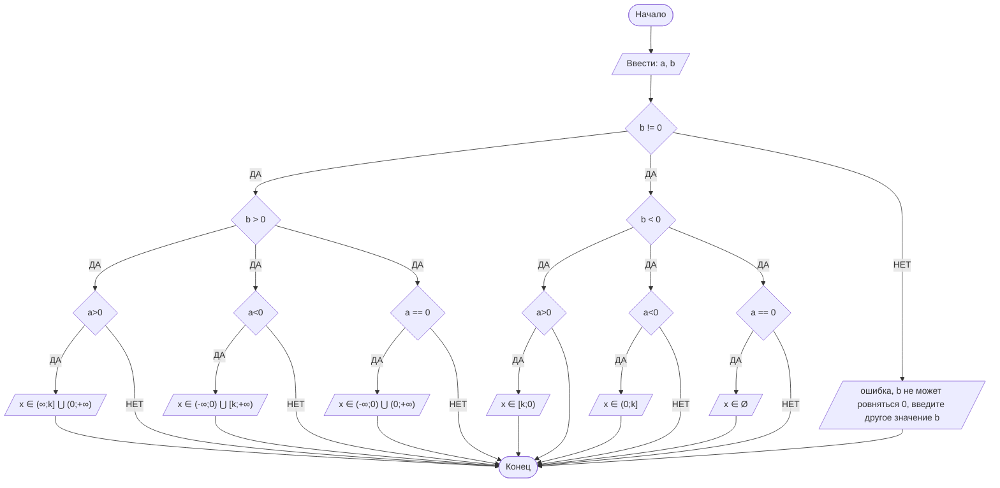

## Отчет по лабораторной работе № 1

#### № группы: `ПМ-2401`

#### Выполнил: `Володченко Анна Андреевна`

#### Вариант: `6`

### Cодержание:

- [Постановка задачи](#1-постановка-задачи)
- [Входные и выходные данные](#2-входные-и-выходные-данные)
- [Выбор структуры данных](#3-выбор-структуры-данных)
- [Алгоритм](#4-алгоритм)
- [Программа](#5-программа)
- [Анализ правильности решения](#6-анализ-правильности-решения)

### 1. Постановка задачи
Дано неравенство:
(x + a) /
(b · x)
≥ 0,

где a и b — параметры (вводятся с клавиатуры). Решите его для x.

> Программа получает на вход 2 числа a и b - коэффициенты при x, не превышающих по модулю 1.79<sup>308</sup>. 
> Нужно решить неравенство относительно x, учитывая ограничения.

- Для решения неравенства следует рассмотреть следующие случаи:
<Если b = 0
<Если b ≠ 0, тогда
> b < 0 
> 
> - a = 0 
> 
> - a < 0 
> 
> - a > 0
> 
>b > 0
> 
> - a = 0
> 
> - a < 0 
> 
> - a > 0

### 2. Входные и выходные данные

#### Данные на вход

На вход программа должна получать 2 числа, при этом в условии не сказано, к какому множеству принадлежат получаемые числа, поэтому будем считать их вещественными. Верхняя и нижняя границы получаемых чисел есть диапазон допустимых значений типа double.

|             | Тип                | min значение          | max значение   |
|-------------|--------------------|-----------------------|----------------|
| X (Число 1) | Вещественное число | -(1.79<sup>308</sup>) | 1.79<sup>308</sup> |
| Y (Число 2) | Вещественное число | -(1.79<sup>308</sup>) | 1.79<sup>308</sup>|

#### Данные на выход

Программа в зависимости от введенных параметров выводит решение неравенства.
Решение выводится в виде строчки(множества решений). Корень числителя ограничен возможными значениями типа double.

|         | Тип    | min значение | max значение |
|---------|--------|--------------|--------------|
| Число 1 | Строка | -            | -            |

### 3. Выбор структуры данных

Программа получает 2 числа (в строке),далее двум переменным типа double присваивается значение этих введенных чисел.

|             | название переменной | Тип (в Java) | 
|-------------|---------------------|--------------|
| a (Число 1) | `a`                 | `double`     |
| b (Число 2) | `b`                 | `double`     | 

Для вывода результата необязательно его хранить в отдельной переменной.

### 4. Алгоритм

1. Если b = 0, конец алгоритма, вывод ошибки
2. Если b ≠ 0, нужно понять, поменяется ли знак неравенства.
3. Если b > 0, знак остается таким же. 
- Если a = 0, то x ≠ 0
- Если a > 0, то x ∈ (-∞ ; a] ∪ (0 ; +∞)
- Если a < 0, то x ∈ (-∞ ; 0) ∪ [a ; +∞)
4. Если b < 0, знак менеятся.
- Если a = 0, то x ∈ Ø.
- Если a > 0, то x ∈ [a ; 0)
- Если a < 0, то x ∈ (0 ; a)
#### Алгоритм выполнения программы:
1. Ввод данных:
  Программа считывает  значения для a и b
2. Решение неравенства: 
- После того, как мы присвоили значения a и b, следует проверить, не равен ли параметр b нулю.
Если это так, программа завершается и выводит сообщение: "b не может ровняться 0, введите другое значение b".
- Даллее программа смотрит, положительный или отрицательный параметр b, потом в при каждом b cмотрит еще три случая: a == 0, a > 0, a < 0
- Затем неравенство решается по методу интервалов, x = 0 - выколотая точка, отмечается корень (его положение относительно x известно, так как мы попадаем в какой-то конкретный случай)
3. Вывод результата:
На экран выводится множество решений, или сообщение о том, что решений нет.

#### Блок-схема



### 5. Программа

```java
import java.io.PrintStream;
import java.util.Scanner;
public class Main {
   public static Scanner in = new Scanner(System.in);
   public static PrintStream out = System.out;
   public static void main(String[] args) {
      out.print("Введите коэффициенты a и b");
      double a = in.nextDouble(); //вводим число a
      double b = in.nextDouble(); //вводим число b
      double k = 0 - a; // создаём переменную k для удобства, k равна числу обратному а
      if (b != 0){  //проверяем условия для b, если b не равно 0 продолжаем решение неравества, если равно 0 выводим ошибку и просим задать другое значение для b
         if (b > 0) { //проверяем условие для b,если оно больше 0 проверяем значение a
            if (a > 0){ //если a больше 0 выводим решение неравенства
               out.print("x ∈ (-∞;");
               out.print(k);
               out.print("] ⋃ (0;+∞)");//выводим решение неравенства при а > 0
            }
            else {
               if (a < 0) {//если a меньше 0 выводим решение неравенства
                  out.print("x ∈ (-∞;0) ⋃ [");
                  out.print(k);
                  out.print(";+∞)");//выводим решение неравенства при а < 0
               }
               else {
                  if (a == 0) {//если a равно 0 выводим решение неравенства
                     out.print("x ∈ (-∞;0) ⋃ (0;+∞)");//выводим решение неравенства при а == 0
                  }
               }
            }
         }
         else
         if (b < 0 ){ //проверяем условие для b,если оно меньше 0 проверяем значение a
            if (a > 0){//если a больше 0 выводим решение неравенства
               out.print("x ∈ [");//выводим решение неравенства при а > 0
               out.print(k);
               out.print(";0)");
            }
            else {
               if (a == 0) {//если a равно 0 выводим решение неравенства
                  out.print("x ∈ Ø");//выводим решение неравенства при а == 0
               } else {
                  if (a < 0) {//если a меньше 0 выводим решение неравенства
                     out.print("x ∈ (0;");//выводим решение неравенства при а < 0
                     out.print(k);
                     out.print("]");
                  }
               }
            }
         }
      }
      else{//если b не прошло проверку,оно равно 0,это ошибка
         out.println("ошибка, b не может ровняться 0, введите другое значение b");//просим исправить ошибку
      }
   }
}
```

### 6. Анализ правильности решения

Программа работает корректно на всем множестве решений с учетом ограничений.

1. Тест на `b > 0, a=0`:

    - **Input**:
        ```
        0 2.3
        ```

    - **Output**:
        ```
      x ∈ (-∞;0) ⋃ (0;+∞)
        ```

2. Тест на `b > 0, a > 0`:

    - **Input**:
        ```
        5.5 5.5
        ```

    - **Output**:
        ```
      x ∈ (-∞;-5.5] ⋃ (0;+∞)
        ```

3. Тест на `b > 0, a < 0`:

    - **Input**:
        ```
        -4.4 3
        ```

    - **Output**:
        ```
      x ∈ (-∞;0) ⋃ [4.4;+∞)
        ```

4. Тест на `b < 0, a = 0`:

    - **Input**:
        ```
        0 -5
        ```

    - **Output**:
        ```
      x ∈ Ø
        ```
5. Тест на `b < 0, a > 0`:

   - **Input**:
       ```
       5 -5
       ```

   - **Output**:
       ```
     x ∈ [-5.0;0)
       ```
6. Тест на `b < 0, a < 0`:

   - **Input**:
       ```
       -2 -2.2
       ```

   - **Output**:
       ```
     x ∈ (0;2.0)
       ```
6. Тест на `b == 0`:

   - **Input**:
       ```
       5 0
       ```

   - **Output**:
       ```
     ошибка, b не может ровняться 0, введите другое значение b

       ```
